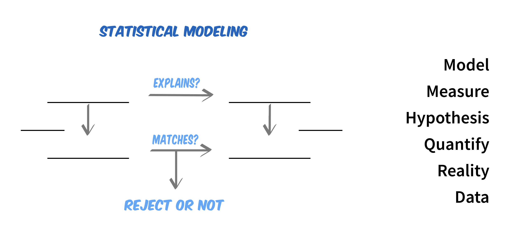

```{r setup, include=FALSE}

```

While Hypothesis Testing and Machine Learning are beginning to overlap, the subjects began as two very distinct fields. Understanding these initial differences will help you better understand Machine Learning—especially if you are coming to Machine Learning from a background in Statistics or Science.

# Hypothesis Testing

Statistical models were originally an extension of _hypothesis testing_. With statistical models, you use a model to test the __________________ in the model.

### Use the words on the left to complete the diagram on the right


```{r echo = FALSE, out.width="100%", fig.align='center'}

```


When using models to test hypotheses, the hypothesis dictates

1. 
2. 
3. 

\bigskip

Although you end up with a fitted model when you do hypothesis testing, the fitted model is of  **circle one:** (utmost / secondary) importance to the task at hand, which is to _________________________.


# Machine Learning

Machine Learning is an extension of computer science. In Machine Learning, you want to develop an algorithm that will allow a computer to make _______________________. When we do Machine Learning, we're **circle one:** (picky, not picky) about which data or model we use, so long as our algorithm has a low ___________________. This isn't to say anything goes; some data sets can not yield a low ___________________.

\bigskip
\bigskip

What is the goal of Machine Learning?

\bigskip
\bigskip
\bigskip
\bigskip
\bigskip

Machine Learners tend to use the same models as hypothesis testers because:

\bigskip
\bigskip
\bigskip
\bigskip
\bigskip

In Machine Learning, the fitted model (i.e. the trained model) is of **circle one:** (utmost / secondary) importance because you use it to generate new predictions.
