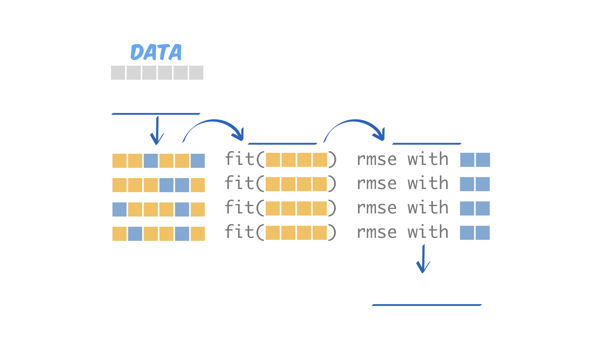
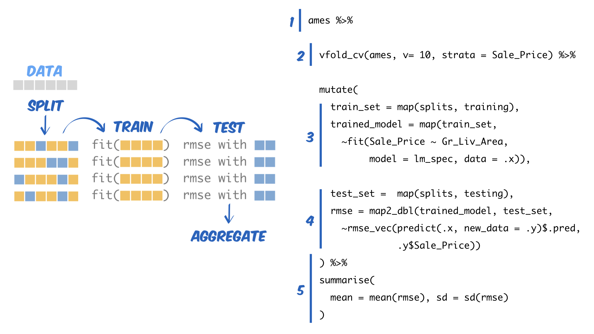

1. Fill in the blanks in the diagram below to label the steps of cross-validation.

```{r echo = FALSE, out.width='100%'}

```


\bigskip
\bigskip
\bigskip

In your own words, answer:

\bigskip

2. Why should we split our data into training and testing sets?


\bigskip
\bigskip
\bigskip
\bigskip
\bigskip
\bigskip
\bigskip
\bigskip
\bigskip
\bigskip
\bigskip
\bigskip
\bigskip
\bigskip

(over)
\pagebreak

3. Why does it make more sense to split our data into several different training and testing sets and average the results (i.e. to cross-validate) than to use a single training/testing set split?

\bigskip
\bigskip
\bigskip
\bigskip
\bigskip
\bigskip
\bigskip
\bigskip
\bigskip
\bigskip
\bigskip
\bigskip
\bigskip
\bigskip
\bigskip
\bigskip
\bigskip
\bigskip
\bigskip
\bigskip
\bigskip

4. The tidyverse code on the right is implementing a cross-validation strategy to evaluate a model with the ames data. Draw a line from each section of code on the right to the word in the diagram on the left that it is associated with. Can you tell what the code does?

\bigskip
\bigskip
\bigskip
\bigskip

```{r echo = FALSE, out.width='100%'}

```