```{r setup, include=FALSE}
options(htmltools.dir.version = FALSE)
options("scipen" = 16)
knitr::opts_chunk$set(collapse = TRUE,
                      fig.retina = 3,
                      comment = NA)
yt_counter <- 0
library(showtext)
font_add_google("Amatic SC", "Amatic SC")
font_add_google("Karla", "Karla")
```

```{r packages, include=FALSE}
library(countdown)
library(tidyverse)
library(tidymodels)
library(scico)
library(gganimate)
library(AmesHousing)
library(workflows)
library(magick)
ames <- make_ames()
theme_set(theme_minimal())
```

```{r helpers, include =FALSE}
fit_data <- function(formula, model, data, ...) {
  wf <- workflows::add_model(workflows::add_formula(workflows::workflow(), formula), model)
  fit(wf, data, ...)
}

fit_split <- function(formula, model, split, ...) {
  wf <- workflows::add_model(workflows::add_formula(workflows::workflow(), formula, blueprint = hardhat::default_formula_blueprint(indicators = FALSE)), model)
  tune::last_fit(wf, split, ...)
}
```

```{r depends-on, include =FALSE}

# split
set.seed(100) # Important!
ames_split  <- initial_split(ames)
ames_train  <- training(ames_split)
ames_test   <- testing(ames_split)

# for figures
train_color <- scico(1, palette = 'buda', begin = .9)
test_color  <- scico(1, palette = 'hawaii', begin = .8)
data_color  <- scico(1, palette = 'roma', begin = .9)
assess_color <- scico(1, palette = 'berlin', begin = .1)
splits_pal <- c(data_color, train_color, test_color)


# smaller for plotting
set.seed(0)
small_ames <- ames %>% 
  sample_n(80) %>% 
  mutate(.row = dplyr::row_number())

# split
set.seed(100) # Important!
small_split  <- initial_split(small_ames)
small_train  <- training(small_split)
small_test   <- testing(small_split)

lm_spec <- 
   linear_reg() %>% # Pick linear regression
   set_engine(engine = "lm") # set engine

lm_fit <- fit_data(Sale_Price ~ Gr_Liv_Area, 
                        model = lm_spec, 
                        data = ames_train)

sales_resid  <- lm_fit %>% 
  predict(new_data = ames_train) %>% 
  mutate(truth = ames_train$Sale_Price)

sales_pred <- lm_fit %>% 
  predict(new_data = ames_test) %>% 
  mutate(truth = ames_test$Sale_Price)

rmse_train <- rmse(sales_resid, truth = truth, estimate = .pred) %>% pull(.estimate)
rmse_test  <- rmse(sales_pred, truth = truth, estimate = .pred) %>% pull(.estimate)
```


class: title-slide, center

<span class="fa-stack fa-4x">
  <i class="fa fa-circle fa-stack-2x" style="color: #ffffff;"></i>
  <strong class="fa-stack-1x" style="color:#E7553C;">`r rmarkdown::metadata$session`</strong>
</span> 

# `r rmarkdown::metadata$title`

## `r rmarkdown::metadata$subtitle`

### `r rmarkdown::metadata$author` &#183; Garrett Grolemund

#### [`r params$class_link`](`r params$class_link`) &#183; [`r params$site_link`](`r params$site_link`)

---
class: middle, center, frame

# Goal of Machine Learning

--


## `r emo::ji("hammer")` construct .display[models] that

--


## `r emo::ji("target")` generate .display[accurate predictions]

--


## `r emo::ji("new")` for .display[future, yet-to-be-seen data]

--

.footnote[Max Kuhn & Kjell Johnston, http://www.feat.engineering/]

---
class: inverse, middle, center

A model doesn't have to be a straight line...

```{r lm-fig, dev = 'svg', dev.args = list(bg = "transparent"), echo=FALSE, fig.align='center'}
ggplot(small_train, aes(Gr_Liv_Area, Sale_Price)) +
  geom_smooth(method = "lm", se = FALSE, colour = "#4D8DC9", lwd=3) +
  geom_point(size = 3, colour = "white") +  
  coord_cartesian(y = c(50000, 500000))+
  theme_void() +
  theme(
    panel.background = element_rect(fill = "transparent", colour = NA), 
    plot.background = element_rect(fill = "transparent", colour = NA),
    legend.background = element_rect(fill = "transparent", colour = NA),
    legend.key = element_rect(fill = "transparent", colour = NA)
  )
```


---
class: inverse, middle, center

.pull-left[
```{r ref.label='lm-fig', dev = 'svg', dev.args = list(bg = "transparent"), echo=FALSE}
```
]

.pull-right[
```{r dev = 'svg', dev.args = list(bg = "transparent"), echo=FALSE, fig.align='center'}
ggplot(small_train, aes(Gr_Liv_Area, Sale_Price)) +
  stat_smooth(method = "lm", se = FALSE, formula = y ~ poly(x, 9), colour = "#4D8DC9",lwd=3) +
  geom_point(size = 3, colour = "white") +  
  coord_cartesian(y = c(50000, 500000))+
  theme_void() +
  theme(
    panel.background = element_rect(fill = "transparent", colour = NA), 
    plot.background = element_rect(fill = "transparent", colour = NA),
    legend.background = element_rect(fill = "transparent", colour = NA),
    legend.key = element_rect(fill = "transparent", colour = NA)
  )
```
]

---
class: middle, frame, center

# Decision Trees

To predict the outcome of a new data point:

Uses rules learned from splits

Each split maximizes information gain

---
class: middle, center


---
```{r include=FALSE}
rt_spec <- 
  decision_tree() %>%          
  set_engine(engine = "rpart") %>% 
  set_mode("regression")

set.seed(1)
rt_fitwf <- fit_split(Sale_Price ~ Gr_Liv_Area, 
                      model = rt_spec, 
                      split = small_split)

rt_fit <- rt_fitwf %>% 
  pluck(".workflow", 1) %>% 
  pull_workflow_fit() %>% 
  .$fit

splt <- rt_fit$splits %>% 
  as_tibble(.) %>% 
  mutate(order = dplyr::row_number()) 
```


```{r echo = FALSE, fig.align='center'}
ggplot(small_train, aes(x = Gr_Liv_Area, y = Sale_Price)) + 
  geom_point(size = 3) +
  geom_vline(data=splt, 
             aes(xintercept = index, 
                 colour=factor(order)), 
             lwd = 5, 
             alpha = .7) + 
  geom_text(data=splt, aes(x=index, 
                           y=max(small_train$Sale_Price), 
                           label=order), nudge_x=0.02) +
  scale_x_continuous(breaks=seq(-0.5, 0.5, 0.1)) +
  scale_colour_scico_d(palette = "buda", end = .8) +
  theme(legend.position="none", 
        text = element_text(family = "Karla")) +
  coord_cartesian(y = c(50000, 500000), x = c(700, 2750))
```

---

```{r echo = FALSE, fig.align='center', message = FALSE, warning = FALSE}
rt_preds <- rt_fitwf %>% 
  collect_predictions() %>% 
  left_join(select(small_test, .row, Gr_Liv_Area)) 

rt_pred_plot <-
  ggplot(rt_preds) + 
  geom_point(aes(x=Gr_Liv_Area, y=Sale_Price), size = 3) +
  geom_line(aes(x=Gr_Liv_Area, y=.pred), colour="#4D8DC9", size=2) +
  geom_vline(data=splt, aes(xintercept = index, colour=factor(order)), 
             lwd = 5, 
             alpha = .7) + 
  scale_colour_scico_d(palette = "buda", end = .8) +
  theme(legend.position="none", 
        text = element_text(family = "Karla")) +
  coord_cartesian(y = c(50000, 500000), x = c(700, 2750))

rt_pred_plot
```


---
class: middle, center

# Quiz

How do assess predictions here?

--

RMSE

---

```{r rt-test-resid, echo = FALSE, fig.align='center'}
rt_pred_plot +
  geom_segment(aes(x = Gr_Liv_Area, 
                   xend = Gr_Liv_Area, 
                   y = Sale_Price, 
                   yend = .pred), 
               colour = "#E7553C") 
```


---
class: middle, center

.pull-left[
### LM RMSE = `r round(rmse_test, 2)`
```{r ref.label='lm-test-resid', echo=FALSE}
```
]

--

.pull-right[

```{r include = FALSE}
rmse_tree <- rt_fitwf %>% 
  collect_predictions() %>% 
  rmse(., truth = Sale_Price, estimate = .pred) %>% 
  pull(.estimate)
```

### Tree RMSE = `r round(rmse_tree, 2)`
```{r ref.label='rt-test-resid', echo=FALSE}
```

]


---
class: inverse, middle, center

.pull-left[
```{r ref.label='lm-fig', dev = 'svg', dev.args = list(bg = "transparent"), echo=FALSE}
```
]

.pull-right[
```{r dt-fig, dev = 'svg', dev.args = list(bg = "transparent"), echo=FALSE, fig.align='center'}
ggplot(rt_preds) + 
  geom_point(data = small_train, aes(x=Gr_Liv_Area, y=Sale_Price), colour = "white", size = 3) +
  geom_line(aes(x=Gr_Liv_Area, y=.pred), colour="#4D8DC9", size=2) + 
  scale_colour_scico_d(palette = "buda", end = .8) +
  coord_cartesian(y = c(50000, 500000), x = c(700, 2750)) +  
  theme_void() +
  theme(
    legend.position="none",
    panel.background = element_rect(fill = "transparent", colour = NA), 
    plot.background = element_rect(fill = "transparent", colour = NA),
    legend.background = element_rect(fill = "transparent", colour = NA),
    legend.key = element_rect(fill = "transparent", colour = NA)
  )
```
]

---
class: middle, center, inverse

# What is a model?

---
class: middle, center, frame

# K Nearest Neighbors (KNN)

To predict the outcome of a new data point:

Find the K most similar old data points

Take the average/mode/etc. outcome

---

```{r}
knn_spec <- nearest_neighbor(neighbors = 5) %>% 
           set_engine("kknn") %>% 
           set_mode("regression")

set.seed(100)
fit_split(Sale_Price ~ ., model = knn_spec, split = ames_split) %>% 
  collect_metrics()
```

---

```{r include=FALSE}
# prep data for knn
knn_rec <- recipe(Sale_Price ~ Gr_Liv_Area, data = small_ames) %>%
  #step_nzv(all_nominal()) %>%
  #step_integer(matches("Qual|Cond|QC|Qu")) %>%
  step_center(all_numeric(), -all_outcomes()) %>%
  step_scale(all_numeric(), -all_outcomes()) 

df <- knn_rec %>%
  prep(training = small_train) %>%
  juice() %>%
  select(Sale_Price, Gr_Liv_Area)
```

```{r include=FALSE}
plot_neighbors <- function(home = 59, k = 5, data = df) {
  set.seed(1)
  index <- as.vector(FNN::knnx.index(data = data[-home, -1], 
                                   query = data[home, -1], 
                                   k = k))
  neighbors <- data %>% 
    mutate(desc = case_when(
      row_number() == home ~ "Home of interest",
      row_number() %in% index ~ "Closest neighbors",
      TRUE ~ NA_character_),
      k = k)
  
  jitter <- position_jitter(width = .1, height = .1, seed = 110)
  
  ggplot(data = neighbors, aes(x = Gr_Liv_Area, y = Sale_Price)) +
    geom_point(position = jitter, aes(fill = desc), size = 5, shape = 21) + 
    scale_fill_scico_d(palette = "buda", end = .8, na.value = "gray90") +
    theme(legend.position="none", 
          text = element_text(family = "Karla")) +
    coord_cartesian(y = c(50000, 500000), x = c(-2, 2.5)) +
    geom_hline(data = filter(neighbors, desc == "Closest neighbors"),
             aes(yintercept = mean(Sale_Price)), lty = 3) +
    ggtitle(glue::glue("k = {neighbors$k}"))
}
```

---

```{r knn-home1, echo=FALSE, fig.align='center'}
plot_neighbors(home = 55)
```

---

```{r knn-home2, echo=FALSE, fig.align='center'}
plot_neighbors()
```

---

```{r knn-home2-10, echo=FALSE, fig.align='center'}
plot_neighbors(home = 59, k = 10)
```

---

```{r knn-home2-25, echo=FALSE, fig.align='center'}
plot_neighbors(home = 59, k = 25)
```

---

```{r knn-home2-50, echo=FALSE, fig.align='center'}
plot_neighbors(home = 59, k = 50)
```


---

.pull-left[
```{r echo=FALSE, fig.align='center'}
plot_neighbors(home = 59, k = 1)
```
]

.pull-right[
```{r underfit-knn, echo=FALSE, message = FALSE}
plot_knnresid <- function(neighbors = 1) {
  set.seed(100)
  knn_preds <- fit_split(Sale_Price ~ Gr_Liv_Area, 
                             model = knn_spec %>% set_args(neighbors = neighbors), 
                             split = small_split) %>% 
  collect_predictions() %>% 
  left_join(select(small_test, .row, Gr_Liv_Area))

  ggplot(knn_preds, aes(x = Gr_Liv_Area, y = .pred)) +
  geom_point() +
  geom_line(color = "blue") +
  geom_point(aes(y = Sale_Price), alpha = .5) +
  geom_segment(aes(x = Gr_Liv_Area, 
                   xend = Gr_Liv_Area, 
                   y = Sale_Price, 
                   yend = .pred), 
               colour = "#E7553C") +
    coord_cartesian(y = c(50000, 500000)) +
    theme(text = element_text(family = "Karla")) 
}

# underfit knn
plot_knnresid(neighbors = 1)
```
]

---

.pull-left[
```{r echo=FALSE, fig.align='center'}
plot_neighbors(home = 59, k = 5)
```
]

.pull-right[
```{r fit-knn, echo=FALSE, message = FALSE}
plot_knnresid(neighbors = 5)
```
]


---
exclude: true
class: inverse

.pull-left[

]

.pull-right[

]


---
class: inverse, middle, center
exclude: true

.pull-left[

]

--

.pull-right[
```{r lr-fig, echo=FALSE, dev = 'svg', dev.args = list(bg = "transparent")}
data(mtcars)
dat <- subset(mtcars, select=c(mpg, am, vs)) 
ggplot(dat, aes(x=mpg, y=vs)) + 
  geom_point(colour = "white", size = 3) + 
  stat_smooth(method="glm", method.args=list(family="binomial"), se=FALSE,
              colour="#4D8DC9", size=2) +
  theme_void()
```
]

.footnote[[Why is logistic regression considered a linear model?](https://sebastianraschka.com/faq/docs/logistic_regression_linear.html)]

---
exclude: true
class: inverse, middle, center

.pull-left[

]

--

.pull-right[
```{r ct-fig, echo=FALSE, dev = 'svg', dev.args = list(bg = "transparent")}
# insert classification tree figure here
```
]


---
class: middle, center
```{r echo=FALSE, out.width = "70%"}
knitr::include_graphics("https://raw.githubusercontent.com/EmilHvitfeldt/blog/master/static/blog/2019-08-09-authorship-classification-with-tidymodels-and-textrecipes_files/figure-html/unnamed-chunk-18-1.png")
```

https://www.hvitfeldt.me/blog/authorship-classification-with-tidymodels-and-textrecipes/

---
class: middle, center
```{r echo=FALSE, out.width = "50%"}
knitr::include_graphics("https://www.kaylinpavlik.com/content/images/2019/12/dt-1.png")
```

https://www.kaylinpavlik.com/classifying-songs-genres/

---
class: middle, center
```{r echo=FALSE}
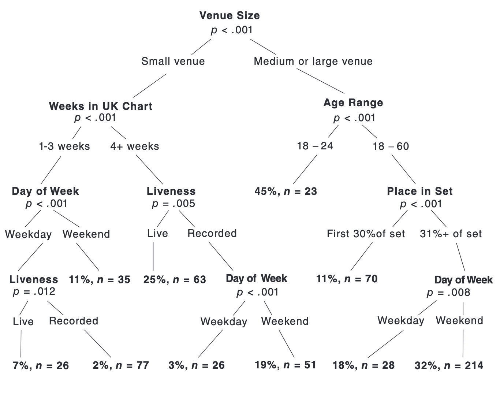
```

[The Science of Singing Along](http://www.doc.gold.ac.uk/~mas03dm/papers/PawleyMullensiefen_Singalong_2012.pdf)

---
class: middle, center

```{r echo=FALSE, out.width='40%'}
knitr::include_graphics("https://a3.typepad.com/6a0105360ba1c6970c01b7c95c61fb970b-pi")
```

.footnote[[tweetbotornot2](https://github.com/mkearney/tweetbotornot2)]


---
name: guess-the-animal
class: middle, center, inverse


```{r echo=FALSE, out.width = '100%'}
knitr::include_graphics("http://www.atarimania.com/8bit/screens/guess_the_animal.gif")
```


---
class: your-turn

# Your turn `r (yt_counter <- yt_counter + 1)`

Get in your teams. Have one member think of an animal; other members try to guess it by asking *yes/no* questions about it. Go!

Write down how many questions it takes your team.

```{r echo=FALSE}
countdown(minutes = 5)
```

---
class: your-turn

# Your turn `r (yt_counter <- yt_counter + 1)`

In your teams, discuss what qualities made for a good versus a bad question.

```{r echo=FALSE}
countdown(minutes = 2)
```

---
class: middle, center

# What makes a good guesser?

--

High information gain per question (can it fly?)

--

Clear features (feathers vs. is it "small"?)

--

Order matters

---
class: inverse, middle, center

# Congratulations!

You just built a decision tree `r emo::ji("tada")`


---
background-image: url(images/aus-standard-animals.png)
background-size: cover

.footnote[[Australian Computing Academy](https://aca.edu.au/resources/decision-trees-classifying-animals/)]

---
background-image: url(images/aus-standard-tree.png)
background-size: cover

.footnote[[Australian Computing Academy](https://aca.edu.au/resources/decision-trees-classifying-animals/)]

---
background-image: url(images/annotated-tree/annotated-tree.001.png)
background-size: cover

---
background-image: url(images/annotated-tree/annotated-tree.002.png)
background-size: cover

---
background-image: url(images/annotated-tree/annotated-tree.003.png)
background-size: cover

---
background-image: url(images/annotated-tree/annotated-tree.004.png)
background-size: cover

---
background-image: url(images/annotated-tree/annotated-tree.005.png)
background-size: cover


---
background-image: url(images/bonsai-anatomy.jpg)
background-size: cover

---
background-image: url(images/bonsai-anatomy-flip.jpg)
background-size: cover

---
class: center, middle

# Quiz

Name that variable type!

```{r echo=FALSE, out.width = "50%", fig.align='center'}
knitr::include_graphics("images/vartypes_quiz.png")
```


---

```{r echo=FALSE, out.width = "80%", fig.align='center'}
knitr::include_graphics("images/vartypes_answers.png")
```

---

```{r echo=FALSE, out.width = "80%", fig.align='center'}
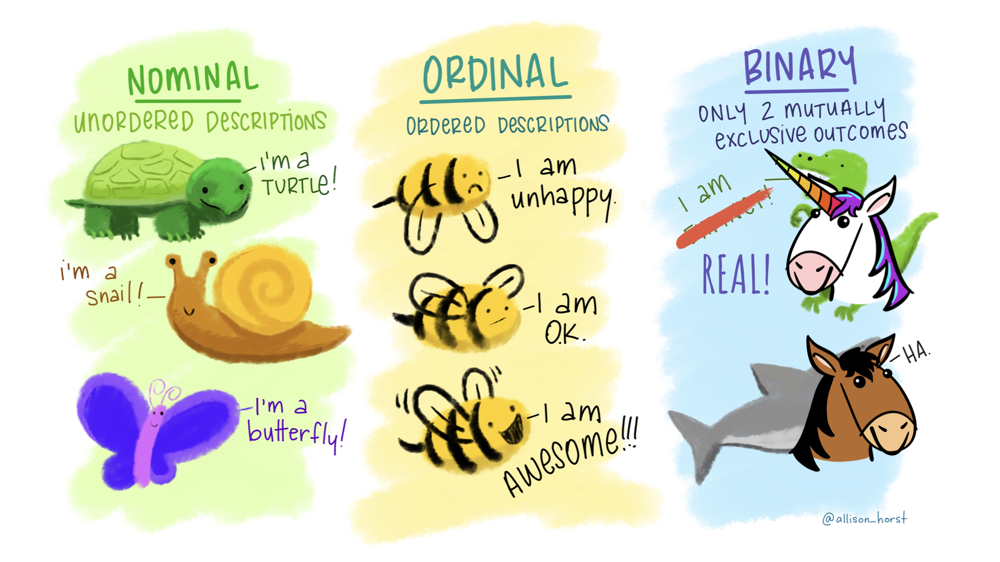
```

---
class: center, middle

# Show of hands

How many people have .display[fit] a logistic regression model with `glm()`?

---
exclude: true

```{r include=FALSE}
uni_train <- iris %>% 
  janitor::clean_names() %>% 
  mutate(unicorn = as.factor(if_else(species == "versicolor", 1, 0))) %>% 
  mutate_at(vars(starts_with("sepal")), .funs = ~(.*10)) %>% 
  select(n_butterflies = sepal_width, n_kittens = sepal_length, unicorn)

# setup stuff
not_col <- scico(1, palette = "acton", begin = .6)
uni_col <- scico(1, palette = "acton", begin = 0)

unicorn <- image_read(here::here("site/static/slides/images/unicorn_horn.png"))
horse <- image_read(here::here("site/static/slides/images/horse_black_mane.png"))
uni_raster <- as.raster(image_fill(unicorn, 'none'))
horse_raster <- as.raster(image_fill(horse, 'none'))
```

---
class: middle, center, inverse

.pull-left[
```{r echo=FALSE}
unicorn
```

]

.pull-right[
```{r echo=FALSE}
horse
```
]

---

.pull-left[
```{r}
uni_train %>% 
  count(unicorn)
```
]

.pull-right[
```{r echo=FALSE}
ggplot(uni_train, aes(x = unicorn, y = n_butterflies, fill = unicorn)) +
  geom_boxplot(alpha = .8) +
  scale_fill_manual(values = c(not_col, uni_col), guide = FALSE) +
  theme(text = element_text(family = "Amatic SC", size = 40),
        plot.margin = unit(c(1, 1, 1, 1), "cm"))
```

]

---

```{r echo=FALSE, fig.align='center'}
ggplot(uni_train, aes(x = n_butterflies, fill = unicorn)) +
  geom_density(alpha = .8, colour = NA) +
  scale_fill_manual(values = c(not_col, uni_col), guide = FALSE) +
  theme(text = element_text(family = "Amatic SC", size = 40)) +
  annotation_raster(uni_raster, 20, 26, .07, .10) +
  annotation_raster(horse_raster, 33, 39, .07, .10)
```

---


```{r include=FALSE}
# do the logistic regression
glm_fit <- glm(unicorn ~ n_butterflies, 
    data = uni_train,
    family = binomial)

uni_glm <- uni_train %>% 
  mutate(prob_uni = predict(glm_fit, type = "response"),
         pred_uni = if_else(prob_uni >= .5, 1, 0))

glm_jitter <- position_jitter(height = .01, seed = 0)
```

```{r echo=FALSE, message = FALSE, warning = FALSE, fig.align='center'}
ggplot(uni_glm, aes(x = n_butterflies, 
                    y = as.numeric(unicorn) - 1)) +
  geom_point(position = glm_jitter, alpha = .7, aes(colour = unicorn), size = 3) +
  scale_colour_manual(values = c(not_col, uni_col), guide = FALSE) +
  theme(text = element_text(family = "Amatic SC", size = 40)) +
  geom_smooth(method="glm", method.args = list(family = "binomial")) +
  labs(y = "Unicorns") +
  annotation_raster(uni_raster, 30, 35, .75, .95) +
  annotation_raster(horse_raster, 20, 25, .05, .25) 
```

---

```{r echo=FALSE, message = FALSE, warning = FALSE, fig.align='center'}
ggplot(uni_glm, aes(x = n_butterflies, 
                    y = prob_uni,
                    colour = unicorn)) +
  geom_point(position = glm_jitter, alpha = .7, size = 3) +
  geom_rug(alpha = .5) +
  scale_colour_manual(values = c(not_col, uni_col), guide = FALSE) +
  theme(text = element_text(family = "Amatic SC", size = 40)) +
  labs(y = "Unicorns") +
  annotation_raster(uni_raster, 30, 35, .75, .95) +
  annotation_raster(horse_raster, 20, 25, .05, .25) 
```


---

```{r echo=FALSE, message = FALSE, warning = FALSE, fig.align='center'}
ggplot(uni_glm, aes(x = n_butterflies, 
                    y = as.numeric(unicorn) - 1)) +
  geom_point(position = glm_jitter, alpha = .7, aes(colour = as.factor(pred_uni)), size = 3) +
  scale_colour_manual(values = c(not_col, uni_col), guide = FALSE) +
  theme(text = element_text(family = "Amatic SC", size = 40)) +
  geom_smooth(method="glm", method.args = list(family = "binomial")) +
  labs(y = "Unicorns") +
  annotation_raster(uni_raster, 30, 35, .75, .95) +
  annotation_raster(horse_raster, 20, 25, .05, .25) 
```


---
class: middle, center


```{r echo=FALSE, fig.align='center', warning=FALSE, message =FALSE}
ggplot(uni_train, aes(x = n_kittens, y = n_butterflies, colour = unicorn)) +
  geom_count(alpha = .9, show.legend = FALSE) +
  scale_colour_manual(values = c(not_col, uni_col)) +
  scale_size_continuous(range = c(4, 10)) +
  annotation_raster(uni_raster, 52, 60, 23, 28) +
  annotation_raster(horse_raster, 45, 52, 35, 40) +
  theme(text = element_text(family = "Amatic SC", size = 40),
        plot.margin = unit(c(1, 1, 1, 1), "cm"))
```

---

```{r include=FALSE}
uni_lnr <- 
  decision_tree(tree_depth = 2) %>%         
  set_engine("rpart", model = TRUE) %>%      
  set_mode("classification") 

uni_wf <- 
  workflow() %>% 
  add_model(uni_lnr) %>% 
  add_formula(unicorn ~ .)

set.seed(0)
uni_tree <-
  uni_wf  %>% 
  fit(data = uni_train) %>% 
  pull_workflow_fit()

uni_train <- uni_tree %>% 
  predict(new_data = uni_train) %>% 
  bind_cols(uni_train)
```

```{r echo=FALSE}
uni_tree
```

---
class: middle, center


```{r echo=FALSE, fig.width=10, warning=FALSE, message=FALSE, fig.align='center'}
library(partykit)
lone_rparty <- as.party(uni_tree$fit)
plot(lone_rparty, 
     terminal_panel=node_barplot(lone_rparty, beside = TRUE))
```

---

```{r echo=FALSE, warning=FALSE, message=FALSE}
library(rpart.plot)
rpart.rules(uni_tree$fit,
            extra = 4, 
            cover = TRUE, 
            nn = TRUE,
            roundint = FALSE)
```


---

```{r echo=FALSE}
# setup for tree parts plots
splt <- uni_tree$fit$splits %>% 
  as_tibble(rownames = "pred") %>% 
  filter(adj == 0) %>%  # filter out surrogate splits
  mutate(order = dplyr::row_number()) %>% 
  mutate(uni_is = if_else(ncat == 1, "lower than", "higher than"))

jitter <- position_jitter(seed = 0)

tree_parts <-
  ggplot(uni_train, aes(x = n_kittens, y = n_butterflies, colour = unicorn)) +
  geom_count(alpha = .9, show.legend = FALSE, position = jitter) +
  scale_size_continuous(range = c(4, 10)) +
  theme(text = element_text(family = "Amatic SC", size = 40)) +
  scale_colour_scico_d(palette = "acton", begin = .6, end = 0) +
  theme_minimal() +
  theme(legend.position="none",
        text = element_text(family = "Karla", color = "#282a36")) +
  coord_cartesian(xlim = c(40, 80), y = c(20, 45), expand = TRUE)
```

.pull-left[
```{r echo=FALSE, fig.align='center'}
tree_parts +
  annotation_raster(uni_raster, 30, 35, .75, .95) +
  annotation_raster(horse_raster, 20, 25, .05, .25) 
```
]

--

.pull-right[
```{r echo=FALSE, fig.align='center'}
ggplot(uni_train, aes(x = n_kittens, y = n_butterflies, colour = .pred_class)) +
  geom_count(alpha = .9, show.legend = FALSE, position = jitter) +
  scale_size_continuous(range = c(4, 10)) +
  theme(text = element_text(family = "Amatic SC", size = 40)) +
  scale_colour_scico_d(palette = "acton", begin = .6, end = 0) +
  theme_minimal() +
  theme(legend.position="none",
        text = element_text(family = "Karla", color = "#282a36")) +
  coord_cartesian(xlim = c(40, 80), y = c(20, 45), expand = TRUE) +
  annotation_raster(uni_raster, 30, 35, .75, .95) +
  annotation_raster(horse_raster, 20, 25, .05, .25) 
```

]

---

.pull-left[

```{r echo=FALSE}
# kittens
tree_parts +
  annotate(geom='rect', xmin = -Inf, xmax = 54.5, ymin = -Inf, ymax = Inf, 
           alpha = .5, fill = not_col) +
  annotate("text", x = 40, y = 40, label = "NOT?", hjust = 0, size = 12, family = "Amatic SC")
```


]

--

.pull-right[

```{r echo=FALSE}
# butterfly
tree_parts +
  annotate(geom='rect', xmin = -Inf, xmax = Inf, ymin = 29.5, ymax = Inf, 
           alpha = .5, fill = not_col) +
  annotate("text", x = 75, y = 40, label = "NOT?", hjust = 0, size = 12, family = "Amatic SC")
```

]

--

### .center[`r emo::ji("butterfly")` split wins]

---

.pull-left[

```{r echo=FALSE}
# kittens
tree_parts +
  annotate(geom='rect', xmin = -Inf, xmax = Inf, ymin = 29.5, ymax = Inf, 
           alpha = .5, fill = not_col) +
  annotate("text", x = 75, y = 40, label = "NOT", hjust = 0, size = 8, family = "Karla") +
  annotate(geom='rect', xmin = -Inf, xmax = 62.5, ymin = -Inf, ymax = 29.5, 
           alpha = .5, fill = uni_col) +
  annotate("text", x = 40, y = 20, label = "UNI?", hjust = 0, size = 12, family = "Amatic SC") +
  annotate(geom='rect', xmin = 62.5, xmax = Inf, ymin = -Inf, ymax = 29.5, 
           alpha = .5, fill = not_col) +
  annotate("text", x = 75, y = 20, label = "NOT?", hjust = 0, size = 12, family = "Amatic SC")
```


]

--

.pull-right[

```{r echo=FALSE}
# butterflies
tree_parts +
  annotate(geom='rect', xmin = -Inf, xmax = Inf, ymin = 29.5, ymax = Inf, 
           alpha = .5, fill = not_col) +
  annotate("text", x = 75, y = 40, label = "NOT", hjust = 0, size = 8, family = "Karla") +
  annotate(geom='rect', xmin = -Inf, xmax = Inf, ymin = 24.5, ymax = 29.5, 
           alpha = .5, fill = uni_col) +
  annotate("text", x = 75, y = 26, label = "UNI?", hjust = 0, size = 12, family = "Amatic SC") +
  annotate(geom='rect', xmin = -Inf, xmax = Inf, ymin = -Inf, ymax = 24.5, 
           alpha = .5, fill = not_col) +
  annotate("text", x = 75, y = 20, label = "NOT?", hjust = 0, size = 12, family = "Amatic SC")
```

]

--

### .center[`r emo::ji("cat")` split wins]


---
class: middle, center

# Sadly, we are not classifying unicorns today

```{r echo=FALSE, fig.align='center', out.width='20%'}
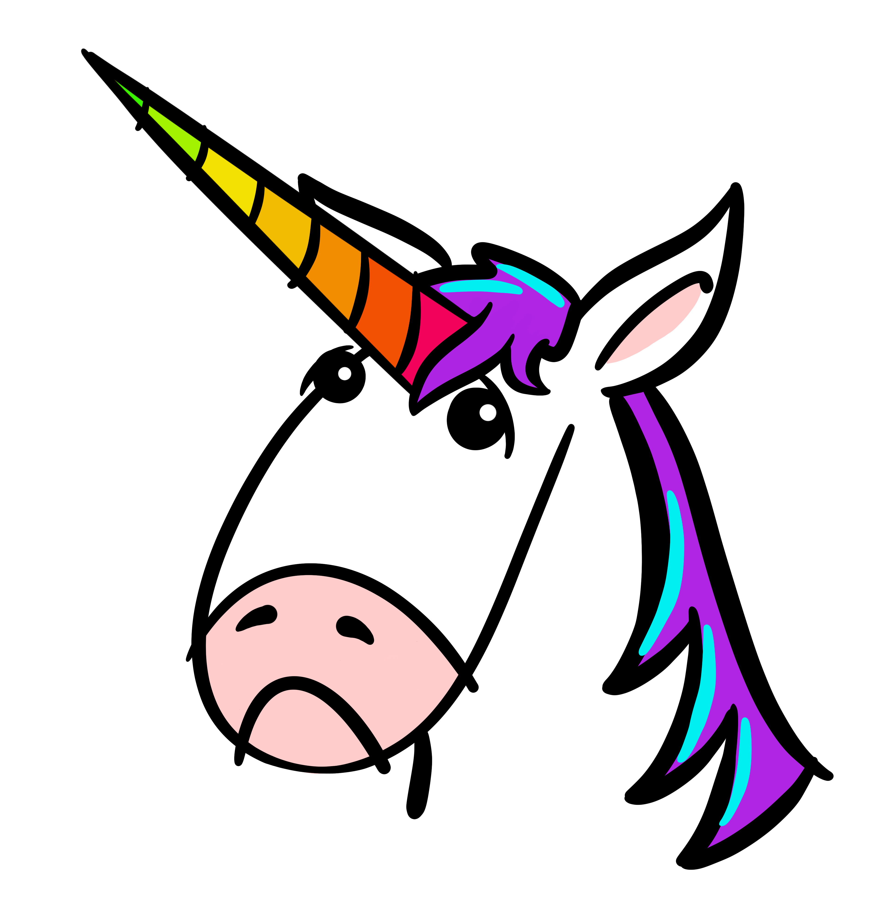
```

---
background-image: url(images/copyingandpasting-big.png)
background-size: contain
background-position: center
class: middle, center

---
background-image: url(images/so-dev-survey.png)
background-size: contain
background-position: center
class: middle, center

---

```{r echo = FALSE, out.width = '80%'}
knitr::include_graphics("https://github.com/juliasilge/supervised-ML-case-studies-course/blob/master/img/remote_size.png?raw=true")
```

.footnote[[Julia Silge](https://supervised-ml-course.netlify.com/)]

???

Notes: The specific question we are going to address is what makes a developer more likely to work remotely. Developers can work in their company offices or they can work remotely, and it turns out that there are specific characteristics of developers, such as the size of the company that they work for, how much experience they have, or where in the world they live, that affect how likely they are to be a remote developer.

---

# StackOverflow Data

```{r include=FALSE}
# read in the data
stackoverflow <- read_rds(here::here("materials/data/stackoverflow.rds"))
```

```{r}
glimpse(stackoverflow)
```

---

# .center[`initial_split()`]

.center["Splits" data randomly into a single testing and a single training set;
extract `training` and `testing` sets from an rsplit]

```{r}
set.seed(100) # Important!
so_split <- initial_split(stackoverflow, strata = remote)
so_train <- training(so_split)
so_test  <- testing(so_split)
```

---
class: your-turn

# Your turn `r (yt_counter <- yt_counter + 1)`

Using the `so_train` and `so_test` datasets, how many individuals in our training set are remote? How about in the testing set?

```{r echo=FALSE}
countdown(minutes = 2)
```


---


```{r so-counts}
so_train %>% 
  count(remote)

so_test %>% 
  count(remote)
```

---

.pull-left[
```{r ref.label='so-counts'}

```

]

.pull-right[

```{r echo=FALSE}
ggplot(stackoverflow, aes(x = remote, y = years_coded_job)) +
  geom_boxplot()
```
]


---
class: inverse, middle, center


# How would we do fit a tree with parsnip?

```{r echo = FALSE, out.width="20%"}
knitr::include_graphics("https://raw.githubusercontent.com/rstudio/hex-stickers/master/PNG/parsnip.png")
```

---
class: middle, frame


# .center[To specify a model with parsnip]

.right-column[

1\. Pick a .display[model]

2\. Set the .display[engine]

3\. Set the .display[mode] (if needed)

]

---
class: middle, center

# 1\. Pick a .display[model] 

All available models are listed at

<tidymodels.github.io/parsnip/articles/articles/Models.html>

```{r echo=FALSE}
knitr::include_url("https://tidymodels.github.io/parsnip/articles/articles/Models.html")
```

---
class: middle, center

# 2\. Set the .display[engine] 

We'll use `rpart` for building `C`lassification `A`nd `R`egression `T`rees

```{r eval=FALSE}
set_engine("rpart") 
```

---
class: middle, center

# 3\. Set the .display[mode] 

A character string for the model type (e.g. "classification" or "regression")

```{r eval=FALSE}
set_mode("classification") 
```

---
class: middle, frame

# .center[To specify a model with parsnip]


```{r eval = FALSE}
decision_tree() %>%
  set_engine("rpart") %>%
  set_mode("classification")
```

---
class: middle

# .center[`fit_split()`]

.center[.fade[Trains and tests a model with split data. Returns a tibble.]]


```{r eval=FALSE}
fit_split(
  formula, 
  model, 
  split
)
```

---
class: your-turn

# Your turn `r (yt_counter <- yt_counter + 1)`

Fill in the blanks. Use the `tree_spec` model provided and `fit_split()` to:

1. Train a CART-based model with the formula = `remote ~ years_coded_job + salary`.

1. Predict remote status with the testing data.

1. Remind yourself what the output looks like!

1. Keep `set.seed(100)` at the start of your code.  

```{r echo=FALSE}
countdown(minutes = 3)
```

---

```{r}
tree_spec <- 
  decision_tree() %>%         
  set_engine("rpart") %>%      
  set_mode("classification") 

set.seed(100) # Important!
tree_fit <- fit_split(remote ~ years_coded_job + salary, 
                      model = tree_spec, 
                      split = so_split) 

tree_fit
```

---
class: middle, center

# Volunteer

How we can expand a list column to see what is in it?

--

`tidyr::unnest()`

.footnote[https://tidyr.tidyverse.org/reference/unnest.html]

---
```{r}
tree_fit %>% 
  unnest(.predictions)
```

---
class: middle, center

# `collect_predictions()`

Unnest the predictions column from a tidymodels `fit_split()`

```{r eval = FALSE}
tree_fit %>% collect_predictions()
```

---

```{r}
tree_fit %>% 
  collect_predictions()
```

---

class: middle, center, frame

# Goal of Machine Learning


## `r emo::ji("hammer")` construct .display[models] that

.fade[

## `r emo::ji("crystal_ball")` generate accurate .display[predictions]

## `r emo::ji("new")` for .display[future, yet-to-be-seen data]

]

---

class: middle, center, frame

# Goal of Machine Learning


.fade[
## `r emo::ji("hammer")` construct .display[models] that


## `r emo::ji("crystal_ball")` generate accurate .display[predictions]

]


## `r emo::ji("new")` for .display[future, yet-to-be-seen data]

---

class: middle, center, frame

# Goal of Machine Learning


.fade[
## `r emo::ji("hammer")` construct .display[models] that

]

## `r emo::ji("crystal_ball")` generate accurate .display[predictions]

.fade[

## `r emo::ji("new")` for .display[future, yet-to-be-seen data]

]
---

class: middle, center, frame

# Goal of Machine Learning


.fade[
## `r emo::ji("hammer")` construct .display[models] that

]

## `r emo::ji("target")` generate .display[accurate predictions]

.fade[

## `r emo::ji("new")` for .display[future, yet-to-be-seen data]

]

---
class: your-turn

# Your turn `r (yt_counter <- yt_counter + 1)`

Use `collect_predictions()` and `count()` to count the number of individuals (i.e., rows) by their true and predicted remote status. In groups, answer the following questions:

1. How many predictions did we make?
2. How many times is "remote" status predicted?
3. How many respondents are actually remote?
4. How many predictions did we get right?

*Hint: You can create a 2x2 table using* `count(var1, var2)`

```{r echo=FALSE}
countdown(minutes = 5)
```

---

```{r}
tree_fit %>%   
  collect_predictions() %>% 
  count(.pred_class, truth = remote)
```

---
class: middle, center

# `conf_mat()`

Creates confusion matrix, or truth table, from a data frame with observed and predicted classes.

```{r eval=FALSE}
conf_mat(data, truth = remote, estimate = .pred_class)
```

---

```{r}
tree_fit %>%   
  collect_predictions() %>% 
  conf_mat(truth = remote, estimate = .pred_class)
```

---

```{r out.width = '40%', fig.align='center'}
tree_fit %>%   
  collect_predictions() %>% 
  conf_mat(truth = remote, estimate = .pred_class) %>% 
  autoplot(type = "heatmap")
```

---
class: middle, center

# Confusion matrix

```{r echo=FALSE}
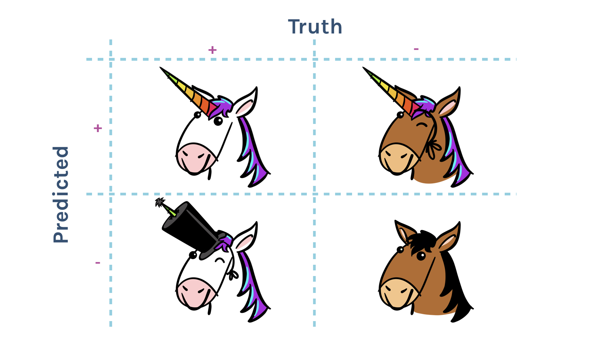
```

---
class: middle, center

# Confusion matrix

```{r echo=FALSE}
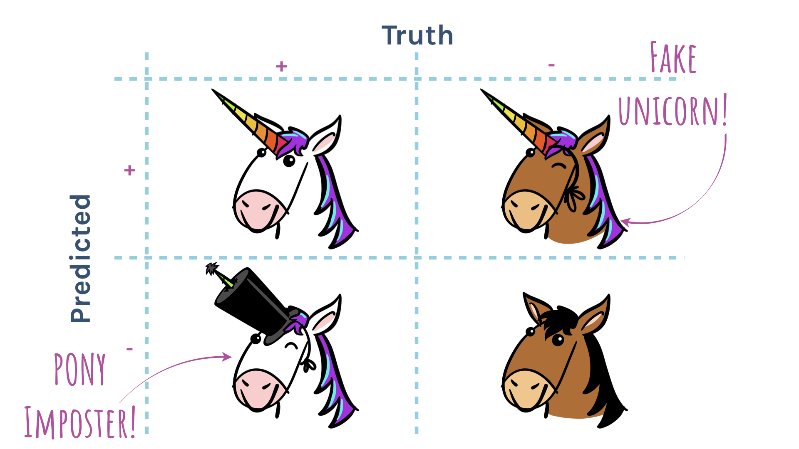
```

---
class: middle, center

# Confusion matrix

```{r echo=FALSE}
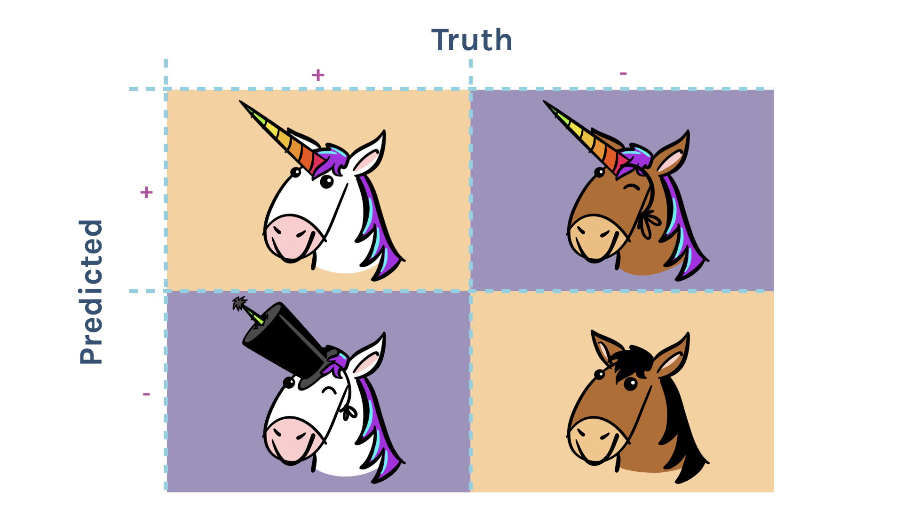
```

---
class: middle, center

# Confusion matrix

```{r echo=FALSE}
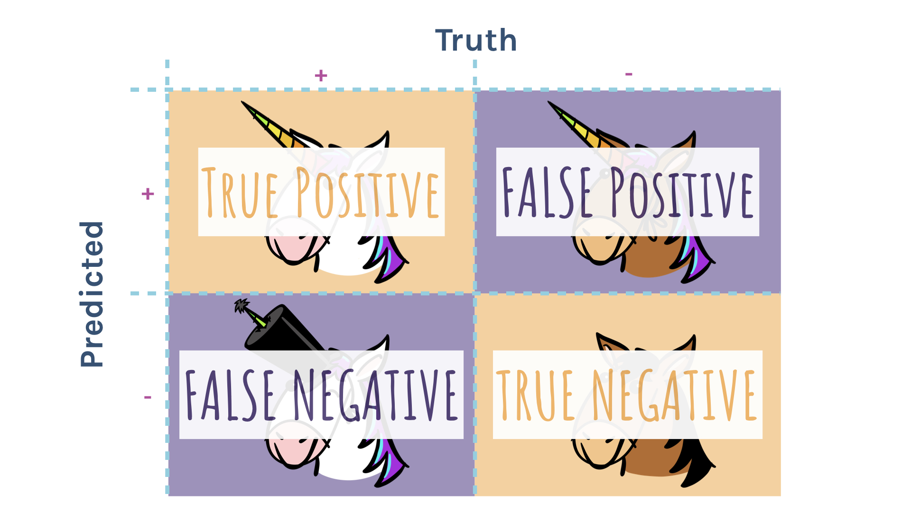
```

---
class: middle, center

# Accuracy 

```{r echo=FALSE}
knitr::include_graphics("images/conf-matrix/conf-matrix.007.jpeg")
```

---
class: middle, center

# Accuracy 

```{r echo=FALSE}
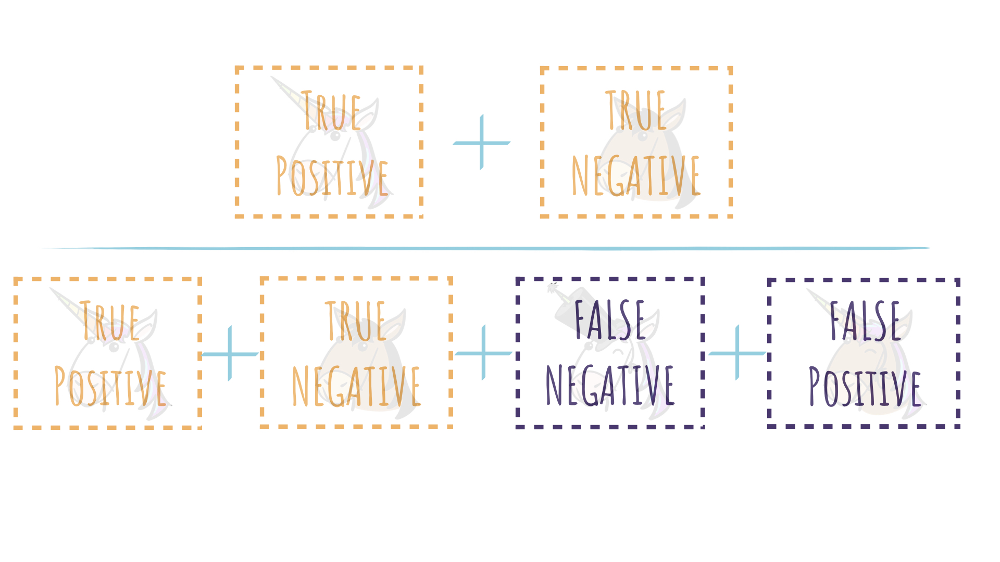
```

---
class: middle, center

# Accuracy 

```{r echo=FALSE}
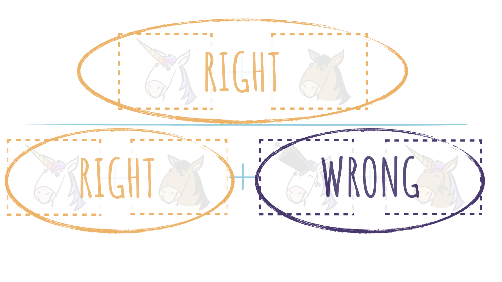
```


---
class: center
background-image: url(images/conf-matrix/sens-spec.jpeg)
background-size: 80%
background-position: bottom

# Sensitivity vs. Specificity

---
name: sens
class: center
background-image: url(images/conf-matrix/sens.jpeg)
background-size: 80%
background-position: bottom

# Sensitivity


---
template: sens

.pull-right[
True positive rate

*Out of all **true positives**, how many did you predict right?*
]

---
name: spec
class: center
background-image: url(images/conf-matrix/spec.jpeg)
background-size: 80%
background-position: bottom

# Specificity


---
template: spec

.pull-left[
True negative rate

*Out of all **true negatives**, how many did you predict right?*
]

---
class: middle, center

# `collect_metrics()`

Unnest the metrics column from a tidymodels `fit_split()`

```{r eval = FALSE}
tree_fit %>% collect_metrics()
```

---

```{r}
tree_fit %>% 
  collect_metrics()
```


---
class: middle, center

```{r echo=FALSE}
knitr::include_url("https://tidymodels.github.io/yardstick/articles/metric-types.html#metrics")
```

<https://tidymodels.github.io/yardstick/articles/metric-types.html#metrics>

---
class: middle

# .center[`fit_split()`]

.center[.fade[Trains and tests a model with split data. Returns a tibble.]]

```{r eval=FALSE}
fit_split(
  formula, 
  model, 
  split, 
  metrics = NULL #<<
)
```

If `NULL`, `accuracy` and `roc_auc` when mode = "classification"

---
class: middle, center

# `metric_set()`

A helper function for selecting yardstick metric functions.

```{r eval=FALSE}
metric_set(accuracy, sens, spec)
```

--

.footnote[Warning! Make sure you load `tidymodels` *after* `tidyverse`, as the `yardstick::spec` function has a name conflict.]

---
class: middle

# .center[`fit_split()`]

.center[.fade[Trains and tests a model with split data. Returns a tibble.]]


```{r eval=FALSE}
fit_split(
  formula, 
  model, 
  split, 
  metrics = metric_set(accuracy, sens, spec) #<<
)
```

---

```{r}
fit_split(remote ~ years_coded_job + salary, 
          model = tree_spec, 
          split = so_split,
          metrics = metric_set(accuracy, sens, spec)) %>% 
  collect_metrics()
```


---

```{r}
fit_split(remote ~ years_coded_job + salary, 
          model = tree_spec, 
          split = so_split,
          metrics = metric_set(accuracy, roc_auc)) %>% 
  collect_metrics()
```

---

```{r}
fit_split(remote ~ years_coded_job + salary, 
          model = tree_spec, 
          split = so_split) %>% 
  collect_metrics()
```

---
class: middle, center

# `roc_curve()`

Takes predictions from `fit_split()`.

Returns a tibble with probabilities.

```{r eval=FALSE}
roc_curve(data, truth = remote, estimate = .pred_Remote)
```

Truth = .display[probability] of target response

Estimate = .display[predicted] class

---

```{r}
fit_split(remote ~ years_coded_job + salary, 
          model = tree_spec, 
          split = so_split) %>% 
  collect_predictions() %>% 
  roc_curve(truth = remote, estimate = .pred_Remote)
```

---
class: your-turn

# Your turn `r (yt_counter <- yt_counter + 1)`

Use `collect_predictions()` and `roc_curve` to calculate the data needed to construct the full ROC curve.

What is the threshold for achieving specificity > .75?
---

```{r}
tree_fit <-
  fit_split(remote ~ years_coded_job + salary, 
            model = tree_spec, 
            split = so_split) 

tree_fit %>% 
  collect_predictions() %>% 
  roc_curve(truth = remote, estimate = .pred_Remote)
```

---

.pull-left[
```{r ggroc, fig.show='hide'}
tree_fit %>% 
  collect_predictions() %>% 
  roc_curve(truth = remote, 
            estimate = .pred_Remote) %>% 
  ggplot(aes(x = 1 - specificity, 
             y = sensitivity)) +
  geom_line(
    color = "midnightblue",
    size = 1.5
  ) +
  geom_abline(
    lty = 2, alpha = 0.5,
    color = "gray50",
    size = 1.2
  )
```
]

.pull-right[
```{r ref.label='ggroc', echo=FALSE}

```

]

---


```{r out.width = '40%', fig.align='center'}
tree_fit %>% 
  collect_predictions() %>%  
  roc_curve(truth = remote, 
            estimate = .pred_Remote) %>% 
  autoplot()
```

---

## Area under the curve


.pull-left[
```{r echo=FALSE}
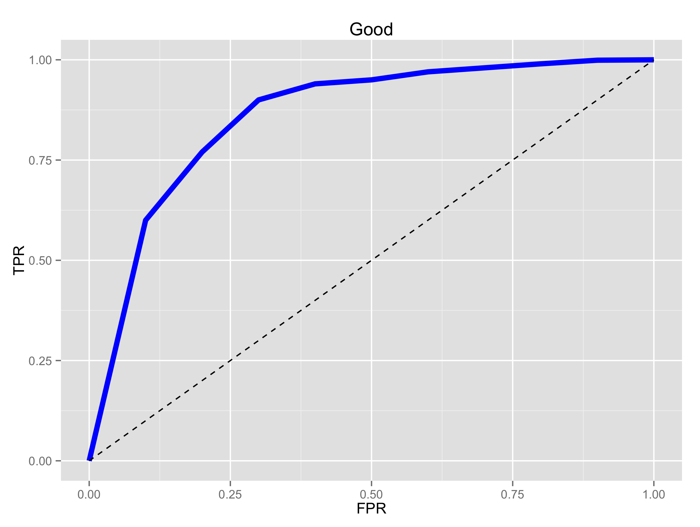
```
]

.pull-right[
* AUC = 0.5: random guessing

* AUC = 1: perfect classifer

* In general AUC of above 0.8 considered "good"
]


---


```{r echo=FALSE, out.width='80%'}
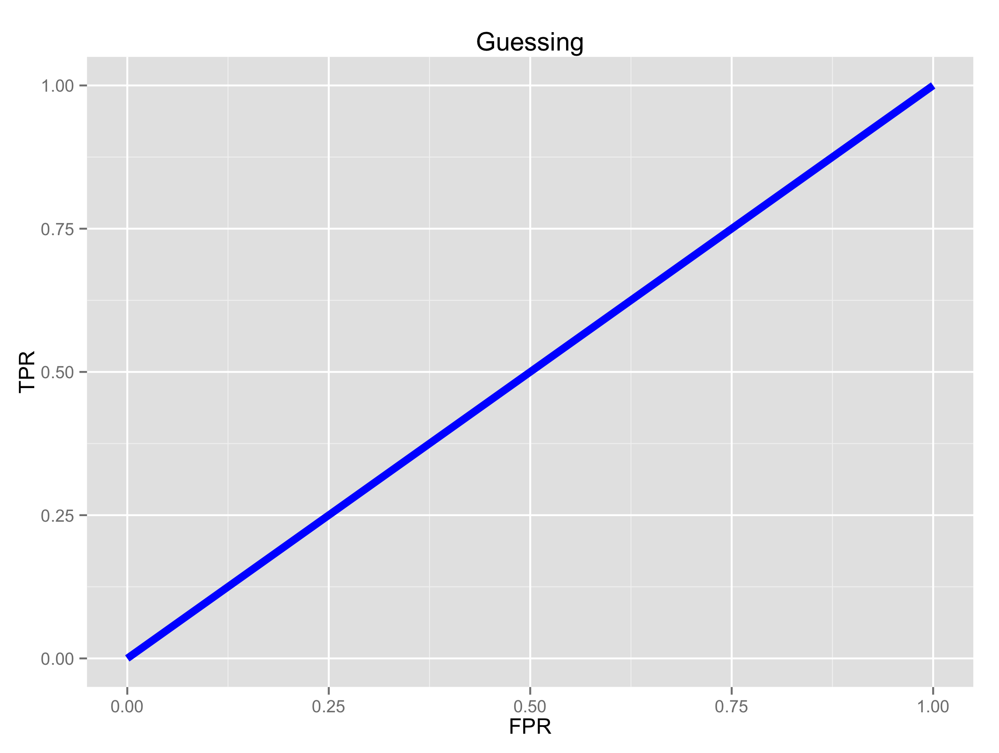
```


---


```{r echo=FALSE, out.width='80%'}
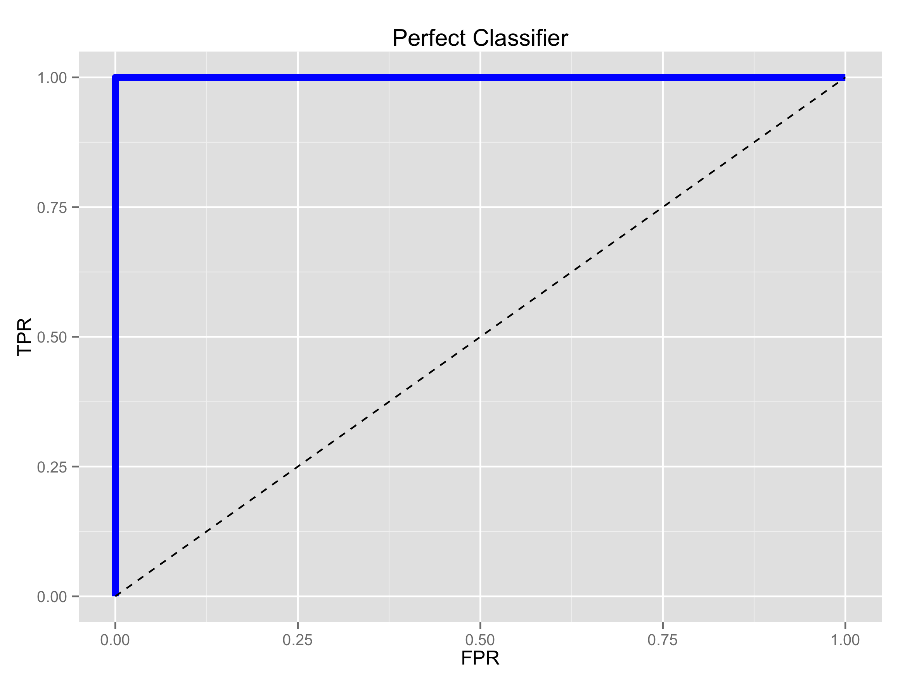
```


---

```{r echo=FALSE, out.width='80%'}
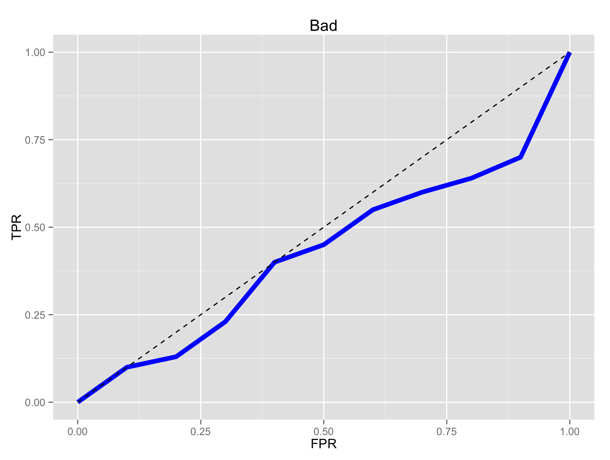
```


---


```{r echo=FALSE, out.width='80%'}
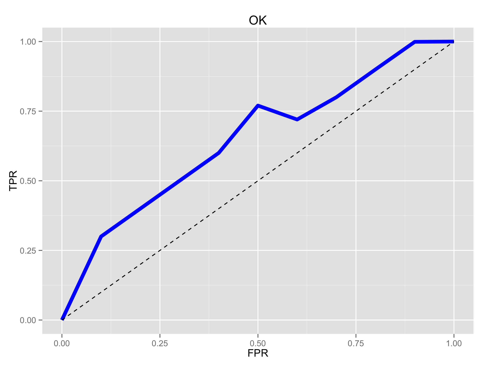
```


---


```{r echo=FALSE, out.width='80%'}

```


---
class: your-turn

# Your turn `r (yt_counter <- yt_counter + 1)`


Add a `autoplot()` to visualize the ROC AUC.

```{r}

```

