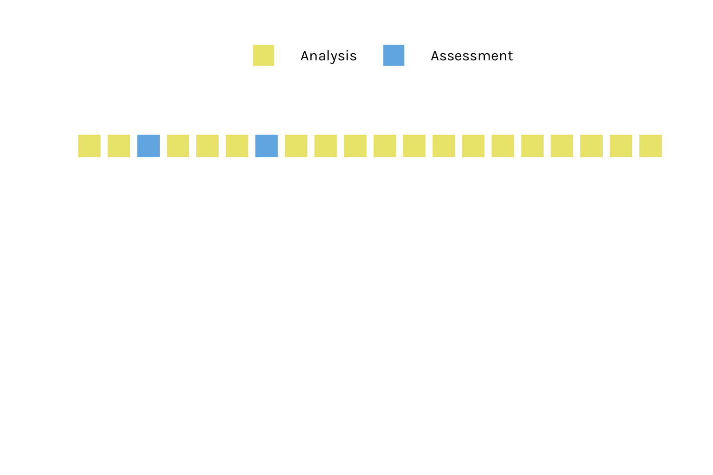

```{r setup, include=FALSE}
options(htmltools.dir.version = FALSE)
options("scipen" = 16)
knitr::opts_chunk$set(collapse = TRUE,
                      fig.retina = 3,
                      fig.path = "figs/03-cv/",
                      comment = NA)
yt_counter <- 0
library(showtext)
font_add_google("Amatic SC", "Amatic SC")
font_add_google("Karla", "Karla")
```

```{r packages, include=FALSE}
library(countdown)
library(tidyverse)
library(tidymodels)
library(workflows)
library(scico)
library(gganimate)
library(AmesHousing)
library(tune)
ames <- make_ames()
theme_set(theme_minimal())

set.seed(100) # Important!
ames_split  <- initial_split(ames)
ames_train  <- training(ames_split)
ames_test   <- testing(ames_split)

# for figures
not_col <- scico(1, palette = "acton", begin = .6)
uni_col <- scico(1, palette = "acton", begin = 0)
train_color <- scico(1, palette = 'buda', begin = .9)
test_color  <- scico(1, palette = 'hawaii', begin = .8)
data_color  <- scico(1, palette = 'roma', begin = .9)
assess_color <- scico(1, palette = 'berlin', begin = .1)
splits_pal <- c(data_color, train_color, test_color)

lm_spec <- 
  linear_reg() %>% 
  set_engine("lm") %>% 
  set_mode("regression")
```

```{r helpers, include =FALSE}
fit_data <- function(object, model, data, ...) {
  if (inherits(object, "formula")) {
    object <- add_model(add_formula(workflow(), object, blueprint = hardhat::default_formula_blueprint(indicators = FALSE)), model)
  }
  fit(object, data, ...)
}

fit_split <- function(object, model, split, ...) {
  if (inherits(object, "formula")) {
    object <- add_model(add_formula(workflow(), object, blueprint = hardhat::default_formula_blueprint(indicators = FALSE)), model)
  }
  tune::last_fit(object, split, ...)
}
```


class: title-slide, center

<span class="fa-stack fa-4x">
  <i class="fa fa-circle fa-stack-2x" style="color: #ffffff;"></i>
  <strong class="fa-stack-1x" style="color:#E7553C;">`r rmarkdown::metadata$session`</strong>
</span> 

# `r rmarkdown::metadata$title`

## `r rmarkdown::metadata$subtitle`

### `r rmarkdown::metadata$author` &#183; Garrett Grolemund

#### [`r params$class_link`](`r params$class_link`) &#183; [`r params$site_link`](`r params$site_link`)    


---
class: middle, center

# Quiz

What property of models is Machine Learning most concerned about?

--

Predictions.


---
class: middle, center, frame

# rsample

```{r echo=FALSE, out.width="100%"}
knitr::include_url("https://tidymodels.github.io/rsample/")
```


---
class: your-turn

# Your Turn `r (yt_counter <- yt_counter + 1)`

Run the first code chunk. Then fill in the blanks to 

1. Create a split object that apportions 75% of ames to a training set and the remainder to a testing set.

1. Fit the all_wf to the split object.

1. Extract the rmse of the fit.

```{r echo=FALSE}
countdown(minutes = 3)
```

---

```{r warnings = FALSE, message = FALSE}
all_wf <- 
  workflow() %>% 
  add_formula(Sale_Price ~ .) %>% 
  add_model(lm_spec)

new_split <- initial_split(ames)
all_wf %>% 
  fit_split(split = new_split,
            metrics = metric_set(rmse)) %>% 
  collect_metrics()
```

---
class: your-turn

# Your Turn `r (yt_counter <- yt_counter + 1)`

What would happen if you repeated this process? Would you get the same answers? Discuss in your team. 

Then rerun the last code chunk from Your Turn 1. Do you get the same answer?

```{r echo=FALSE}
countdown(minutes = 2)
```

---

.pull-left[
```{r new-split, echo=FALSE, warnings = FALSE, message = FALSE}
new_split <- initial_split(ames)
all_wf %>% 
  fit_split(split = new_split,
            metrics = metric_set(rmse)) %>% 
  collect_metrics()
```

```{r ref.label='new-split', echo=FALSE, warnings = FALSE, message = FALSE}
```

```{r ref.label='new-split', echo=FALSE, warnings = FALSE, message = FALSE}
```

]

--

.pull-right[
```{r ref.label='new-split', echo=FALSE, warnings = FALSE, message = FALSE}
```

```{r ref.label='new-split', echo=FALSE, warnings = FALSE, message = FALSE}
```

```{r ref.label='new-split', echo=FALSE, warnings = FALSE, message = FALSE}
```

]

---
class: middle, center

# Quiz

Why is the new estimate different?

---

```{r include=FALSE}
plot_split <- function(seed = 1, arrow = FALSE) {
  set.seed(seed)
  one_split <- slice(ames, 1:20) %>% 
    initial_split() %>% 
    tidy() %>% 
    add_row(Row = 1:20, Data = "Original") %>% 
    mutate(Data = case_when(
      Data == "Analysis" ~ "Training",
      Data == "Assessment" ~ "Testing",
      TRUE ~ Data
    )) %>% 
    mutate(Data = factor(Data, levels = c("Original", "Training", "Testing")))
  
  both_split <-
    one_split %>% 
    filter(!Data == "Original") %>% 
    ggplot(aes(x = Row, y = 1, fill = Data)) + 
    geom_tile(color = "white",
              size = 1) + 
    scale_fill_manual(values = splits_pal[2:3],
                       guide = FALSE) +
    theme_void() +
    #theme(plot.margin = unit(c(-1, -1, -1, -1), "mm")) +
    coord_equal() + {
    # arrow is TRUE
    if (arrow == TRUE) 
      annotate("segment", x = 31, xend = 32, y = 1, yend = 1, 
               colour = assess_color, size=1, arrow=arrow())
    } + {
    # arrow is TRUE
    if (arrow == TRUE)
        annotate("text", x = 33.5, y = 1, colour = assess_color, size=8, 
                 label = "RMSE", family="Karla")
    }

  
  both_split
}
```

---
class: middle, center

# Data Splitting

```{r echo=FALSE, fig.width = 10, fig.height = .5, fig.align = 'center', warning = FALSE, message = FALSE}
plot_split() + scale_fill_manual(values = rep("gray80", 2),
                       guide = FALSE)
```

--

```{r echo=FALSE, fig.width = 10, fig.height = .5, fig.align = 'center'}
plot_split(seed = 100)
```

--

```{r echo=FALSE, fig.width = 10, fig.height = .5, fig.align = 'center'}
plot_split(seed = 1)
```

--

```{r echo=FALSE, fig.width = 10, fig.height = .5, fig.align = 'center'}
plot_split(seed = 10)
```

--

```{r echo=FALSE, fig.width = 10, fig.height = .5, fig.align = 'center'}
plot_split(seed = 18)
```

--

```{r echo=FALSE, fig.width = 10, fig.height = .5, fig.align = 'center'}
plot_split(seed = 30)
```

--

```{r echo=FALSE, fig.width = 10, fig.height = .5, fig.align = 'center'}
plot_split(seed = 31)
```

--

```{r echo=FALSE, fig.width = 10, fig.height = .5, fig.align = 'center'}
plot_split(seed = 21)
```

--

```{r echo=FALSE, fig.width = 10, fig.height = .5, fig.align = 'center'}
plot_split(seed = 321)
```

---


```{r echo=FALSE, fig.width = 15, fig.height = .5, fig.align = 'center'}
plot_split(seed = 100, arrow = TRUE)
```

--

```{r echo=FALSE, fig.width = 15, fig.height = .5, fig.align = 'center'}
plot_split(seed = 1, arrow = TRUE)
```

--

```{r echo=FALSE, fig.width = 15, fig.height = .5, fig.align = 'center'}
plot_split(seed = 10, arrow = TRUE)
```

--

```{r echo=FALSE, fig.width = 15, fig.height = .5, fig.align = 'center'}
plot_split(seed = 18, arrow = TRUE)
```

--

```{r echo=FALSE, fig.width = 15, fig.height = .5, fig.align = 'center'}
plot_split(seed = 30, arrow = TRUE)
```

--

```{r echo=FALSE, fig.width = 15, fig.height = .5, fig.align = 'center'}
plot_split(seed = 31, arrow = TRUE)
```

--

```{r echo=FALSE, fig.width = 15, fig.height = .5, fig.align = 'center'}
plot_split(seed = 21, arrow = TRUE)
```

--

```{r echo=FALSE, fig.width = 15, fig.height = .5, fig.align = 'center'}
plot_split(seed = 321, arrow = TRUE)
```

--

.right[Mean RMSE]

---
class: your-turn

# Your Turn `r (yt_counter <- yt_counter + 1)`

Rerun the code below 10 times and then compute the mean of the results (you will need to jot them down as you go).

```{r echo=FALSE}
countdown(minutes = 3)
```

---

```{r include = FALSE}
set.seed(9)
```


```{r cv-for-loop, include = FALSE}
rmses <- vector(length = 10, mode = "double")
for (i in 1:10) {
  new_split <- initial_split(ames)
  rmses[i] <-
    all_wf %>% 
      fit_split(split = new_split,
                metrics = metric_set(rmse)) %>% 
      collect_metrics() %>% 
      pull(.estimate)
}
```

```{r}
rmses %>% tibble::enframe(name = "rmse")
mean(rmses)
```

---
class: middle, center

# Discuss

Which do you think is more accurate, the best result or the mean of the results? Why? Discuss with your team.

---
class: middle, center, inverse

# Cross-validation

---

# There has to be a better way...

```{r ref.label='cv-for-loop', eval = FALSE}
```


---
class: middle, center

# V-fold cross-validation

```{r eval=FALSE}
vfold_cv(data, v = 10, ...)
```


---

```{r cv, fig.height=4, echo=FALSE}
set.seed(1)
folds10 <- slice(ames, 1:20) %>% 
  vfold_cv() %>% 
  tidy()

folds <- ggplot(folds10, aes(x = Row, y = fct_rev(Fold), fill = Data)) + 
  geom_tile(color = "white",
            width = 1,
            size = 1) + 
  scale_fill_manual(values = c(train_color, assess_color)) +
  theme(axis.text.y = element_blank(),
        axis.text.x = element_blank(),
        legend.position = "top",
        panel.grid = element_blank(),
        text = element_text(family = "Karla"),
        legend.key.size = unit(.4, "cm"),
        legend.text = element_text(size = rel(.4))) +
  coord_equal() +
  labs(x = NULL, y = NULL, fill = NULL) 
```

```{r anim-cv, echo=FALSE, fig.path="figs/gif/", gganimate = list(nframes = 100, fps = 5), fig.height=4, eval=FALSE}
anim_folds <- folds + 
    theme(axis.text.y = element_blank()) +
    transition_states(Fold) +
    shadow_mark(past = TRUE)
anim2 <- gganimate::animate(anim_folds, nframes = 100, fps = 5, detail = 5, width = 1000, 
                           height = 600, res = 330, 
                           type = "cairo", renderer = gifski_renderer(loop = FALSE))
anim <- gganimate::animate(anim_folds, nframes = 100, fps = 5, detail = 5, width = 1500, 
                           height = 1000, res = 500, 
                           type = "cairo", renderer = gifski_renderer(loop = FALSE))
gganimate::anim_save(filename = "cv.gif",
          animation = anim,
          path = here::here("Day-2/slides/images/"))
```


```{r echo=FALSE, fig.align='center'}

```


---
class: middle, center

# Guess

How many times does in observation/row appear in the assessment set?

```{r vfold-tiles, echo=FALSE, fig.height=6, fig.width = 12, fig.align='center'}
folds +
    theme(axis.text.y = element_text(size = rel(2)),
          legend.key.size = unit(.85, "cm"),
          legend.text = element_text(size = rel(1)))
```

---

```{r echo=FALSE, fig.height=6, fig.width = 12, fig.align='center', warning=FALSE, message=FALSE}
test_folds <- tibble(
  Row = seq(1, 20, 1),
  Data = "assessment",
  Fold = rep(1:10, each = 2)
) 

# i want all 20 rows, for all 10 folds
all_rows <- tibble(
  Row = rep(seq(1, 20, 1), 10),
  Fold = rep(1:10, each = 20)
)

train_folds <- all_rows %>% 
  anti_join(test_folds)

all_folds <- test_folds %>% 
  full_join(train_folds) %>% 
  mutate(Fold = as.factor(Fold)) %>% 
  mutate(Data = replace_na(Data, "analysis"))

ggplot(all_folds, aes(x = Row, y = fct_rev(Fold), fill = Data)) + 
  geom_tile(color = "white",
            width = 1,
            size = 1) + 
  scale_fill_manual(values = c(train_color, assess_color), guide = FALSE) +
  theme(axis.text.y = element_blank(),
        axis.text.x = element_blank(),
        legend.position = "top",
        panel.grid = element_blank(),
        text = element_text(family = "Karla"),
        legend.key.size = unit(.4, "cm"),
        legend.text = element_text(size = rel(.4))) +
  coord_equal() +
  labs(x = NULL, y = NULL, fill = NULL) 
```

---
class: middle, center

# Quiz

If we use 10 folds, which percent of our data will end up in the training set and which percent in the testing set for each fold?

--

90% - training

10% - test

---
class: your-turn

# Your Turn `r (yt_counter <- yt_counter + 1)`

Run the code below. What does it return?

```{r make-ames-cv, results='hide'}
set.seed(100)
cv_folds <- 
    vfold_cv(ames_train, v = 10, strata = Sale_Price, breaks = 4)
cv_folds
```

```{r echo=FALSE}
countdown(minutes = 1)
```

---
```{r ref.label='make-ames-cv'}
```

---
class: middle

.center[
# We need a new way to fit
]

```{r eval=FALSE}
split1 <- cv_folds %>% 
  pluck("splits", 1)
all_wf %>% 
  fit_split(split = split1,
            metrics = metric_set(rmse)) %>% 
  collect_metrics()

# rinse and repeat
split2 <- ...
```


---
class: inverse, middle, center

# `fit_resamples()`

---
class: middle

.center[
# `fit_resamples()`

Trains and tests a model with cross-validation.
]

```{r fit-ames-cv, results='hide'}
fit_resamples(
  Sale_Price ~ Gr_Liv_Area, 
  model = lm_spec,          
  resamples = cv_folds
)
```

---

```{r ref.label='fit-ames-cv', warning=FALSE, messages=FALSE}

```


---

# `fit_resamples()`

.pull-left[
Fit with formula and model
```{r eval=FALSE}
fit_resamples(
  Sale_Price ~ Gr_Liv_Area, #<<
  model = lm_spec,        #<<  
  resamples = cv_folds
)
```
]

.pull-right[
Fit with workflow
```{r eval=FALSE}
fit_resamples(
  all_wf, #<<
  resamples = cv_folds
)
```
]


---
class: middle, center

# `collect_metrics()`

Unnest the metrics column from a tidymodels `fit_resamples()`

```{r eval = FALSE}
_results %>% collect_metrics(summarize = TRUE)
```

--

.footnote[`TRUE` is actually the default; averages across folds]

---
class: your-turn

# Your Turn `r (yt_counter <- yt_counter + 1)`

Modify the code below to use `fit_resamples()` and `cv_folds` to cross-validate the `all_wf` workflow. 

Which RMSE do you collect at the end?

```{r eval=FALSE}
all_wf %>% 
  fit_split(split = new_split,
            metrics = metric_set(rmse)) %>% 
  collect_metrics()
```

```{r echo=FALSE}
countdown(minutes = 3)
```


---
```{r warning=FALSE, message=FALSE}
all_wf %>% 
  fit_resamples(resamples = cv_folds,
                metrics = metric_set(rmse)) %>% 
  collect_metrics()
```

---
class: inverse, middle, center

# Comparing Models

---
class: your-turn

# Your Turn `r (yt_counter <- yt_counter + 1)`

Create two new workflows, one that fits the bedbath model, 
`Sale_Price ~ Bedroom_AbvGr + Full_Bath + Half_Bath` 
and one that fits the square foot model, 
`Sale_Price ~ Gr_Liv_Area`

Then use `fit_resamples` and `cv_folds` to compare the performance of each.

```{r echo=FALSE}
countdown(minutes = 6)
```

---
```{r results='hide'}
bb_wf <- 
  workflow() %>% 
    add_formula(Sale_Price ~ Bedroom_AbvGr + Full_Bath + Half_Bath) %>% 
    add_model(lm_spec)

sqft_wf <- 
  workflow() %>% 
    add_formula(Sale_Price ~ Gr_Liv_Area) %>% 
    add_model(lm_spec)

bb_wf %>% 
  fit_resamples(resamples = cv_folds) %>% 
  collect_metrics()

sqft_wf %>% 
  fit_resamples(resamples = cv_folds) %>% 
  collect_metrics()
```

---
class: middle

.pull-left[
```{r}
bb_wf %>% 
  fit_resamples(resamples = cv_folds) %>% 
  collect_metrics()
```

]

.pull-right[
```{r}
sqft_wf %>% 
  fit_resamples(resamples = cv_folds) %>% 
  collect_metrics()
```


]

---
class: middle, center

# Quiz

Why should you use the same data splits to compare each model?

--

`r emo::ji("apple")` to `r emo::ji("apple")`

---
class: middle, center

# Quiz

Does Cross-Validation measure the accuracy of just your model, or your entire workflow?

--

Your entire workflow

---
class: your-turn

# Your Turn `r (yt_counter <- yt_counter + 1)`

Work together with your teammates to complete the Cross-Validation handout.

```{r echo=FALSE}
countdown(minutes = 5)
```

---
background-image: url(images/cv-match.jpeg)
background-size: contain

---
background-image: url(images/vfoldcv/vfoldcv.001.jpeg)
background-size: contain

---
background-image: url(images/vfoldcv/vfoldcv.002.jpeg)
background-size: contain

---
background-image: url(images/vfoldcv/vfoldcv.003.jpeg)
background-size: contain

---
background-image: url(images/vfoldcv/vfoldcv.004.jpeg)
background-size: contain

---
background-image: url(images/vfoldcv/vfoldcv.005.jpeg)
background-size: contain

---
class: middle, center, inverse

# Other types of cross-validation

---
class: middle, center

# `vfold_cv()` - V Fold cross-validation

```{r ref.label='vfold-tiles', echo=FALSE, fig.height=6, fig.width = 12, fig.align='center'}
```

---
class: middle, center

# `loo_cv()` - Leave one out CV

```{r loocv, echo=FALSE, fig.height=7, fig.width = 7, fig.align='center'}
set.seed(1)
loo10 <- slice(ames, 1:10) %>% 
  loo_cv() %>% 
  tidy() %>% 
  mutate(Resample = as.factor(parse_number(Resample))) 

loo <- ggplot(loo10, aes(x = Row, 
                         y = fct_reorder2(Resample, Data, Row), 
                         fill = Data)) + 
  geom_tile(color = "white",
            width = 1,
            size = 1) + 
  scale_fill_manual(values = c(train_color, assess_color)) +
  theme(axis.text.y = element_text(size = rel(2)),
        axis.text.x = element_blank(),
        legend.position = "top",
        panel.grid = element_blank(),
        text = element_text(family = "Karla"),
        legend.key.size = unit(.85, "cm"),
        legend.text = element_text(size = rel(1))) +
  coord_equal() +
  labs(x = NULL, y = NULL, fill = NULL) +
  scale_y_discrete(labels = rev(seq(1, 10, 1)))
loo
```

---
class: middle, center

# `mc_cv()` - Monte Carlo (random) CV

(Test sets sampled without replacement)

```{r mccv, echo=FALSE, fig.height=6, fig.width = 12, fig.align='center'}
set.seed(1)
mc10 <- slice(ames, 1:20) %>% 
  mc_cv(times = 10) %>% 
  tidy() 

mc <- ggplot(mc10, aes(x = Row, 
                         y = fct_rev(Resample), 
                         fill = Data)) + 
  geom_tile(color = "white",
            width = 1,
            size = 1) + 
  scale_fill_manual(values = c(train_color, assess_color)) +
  theme(axis.text.y = element_text(size = rel(2)),
        axis.text.x = element_blank(),
        legend.position = "top",
        panel.grid = element_blank(),
        text = element_text(family = "Karla"),
        legend.key.size = unit(.85, "cm"),
        legend.text = element_text(size = rel(1))) +
  coord_equal() +
  labs(x = NULL, y = NULL, fill = NULL) 
mc
```


---
class: middle, center

# `bootstraps()`

(Test sets sampled with replacement)

```{r bootstrap, echo=FALSE, fig.height=6, fig.width = 12, fig.align='center'}
set.seed(15)
so_boots <- bootstraps(slice(ames, 1:20), times = 10)

bt_rows <- data.frame(
  Row = unlist(lapply(so_boots$splits, function(x) sort(x$in_id))),
  Resample = rep(recipes:::names0(10, "Bootstrap"), 
                 each = nrow(slice(ames, 1:20)))) %>% 
  count(Resample, Row, sort = TRUE) %>% 
  complete(Resample, Row) %>% 
  mutate(n = factor(n),
         Resample = factor(Resample)) 

boots <- ggplot(bt_rows , aes(x = Row, y = fct_rev(Resample), fill = n)) + 
  geom_tile(color = "white",
            width = 1,
            size = 1) + 
  theme(axis.text.y = element_text(size = rel(2)),
        axis.text.x = element_blank(),
        legend.position = "top",
        panel.grid = element_blank(),
        text = element_text(family = "Karla"),
        legend.key.size = unit(.85, "cm"),
        legend.text = element_text(size = rel(1))) +
  scale_fill_scico_d(palette = 'buda', 
                     begin = 0, 
                     end = .9, 
                     direction = -1,
                     na.value = assess_color,
                     labels = c("1", "2", "3", "4", "Assessment")) +
  coord_equal() +
  labs(x = NULL, y = NULL, fill = NULL) 
boots
```

---
class: middle, center, frame


# yardstick

Functions that compute common model metrics

<tidymodels.github.io/yardstick/>

```{r echo=FALSE, out.width="100%"}
knitr::include_url("https://tidymodels.github.io/yardstick/")
```


---
class: middle

.center[
# `fit_resamples()`

Trains and tests a model with cross-validation.
]

.pull-left[

```{r eval = FALSE}
fit_resamples(
  object, 
  resamples, 
  ..., 
  metrics = NULL,  #<<
  control = control_resamples()
)
```

]

.pull-right[

If `NULL`...

regression = `rmse` + `rsq`

classification = `accuracy` + `roc_auc`
]

---
class: middle, center

# `metric_set()`

A helper function for selecting yardstick metric functions.

```{r eval=FALSE}
metric_set(rmse, rsq)
```

---
class: middle

.center[
# `fit_resamples()`

.fade[Trains and tests a model with cross-validation.]
]

.pull-left[

```{r eval = FALSE}
fit_resamples(
  object, 
  resamples, 
  ..., 
  metrics = metric_set(rmse, rsq),  #<<
  control = control_resamples()
)
```

]

---
class: middle, center, frame


# Metric Functions


<https://tidymodels.github.io/yardstick/reference/index.html>

```{r echo=FALSE, out.width="100%"}
knitr::include_url("https://tidymodels.github.io/yardstick/reference/index.html")
```

---
class: your-turn

# Your Turn `r (yt_counter <- yt_counter + 1)`


Modify the code below to return the **Mean Absolute Error.** Visit 
<https://tidymodels.github.io/yardstick/reference/index.html> to find the right function to use.

```{r echo=FALSE}
countdown(minutes = 3)
```

---
```{r}
bb_wf %>% 
  fit_resamples(resamples = cv_folds, 
  metrics = metric_set(mae)) %>% 
  collect_metrics()

sqft_wf %>% 
  fit_resamples(resamples = cv_folds, 
  metrics = metric_set(mae)) %>% 
  collect_metrics()
```

